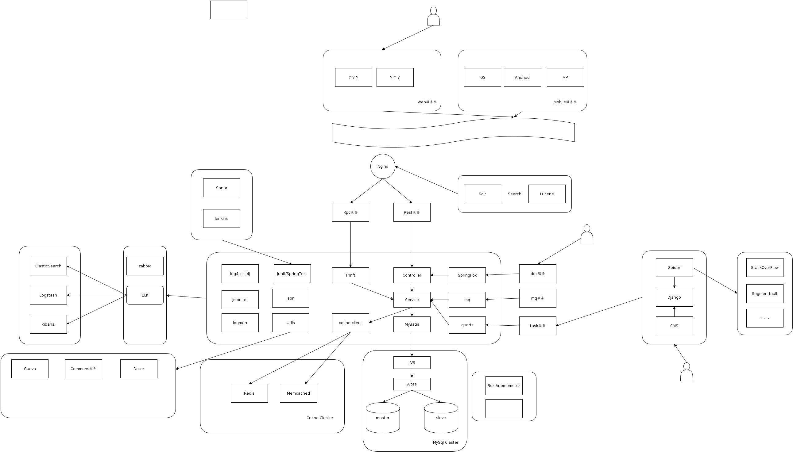

## bugkillers
致力成为一个中国的StackOverflow
###简介
* 官网：http://bugkillers.org
* 团队：bugkiller、lxy
* 代码托管：https://github.com/qq291462491/bugkillers/
* demo演示：http://bugkillers.org/api/

###后端架构
* 后端采用Springmvc + Mybatis持久化操作.
* 基于RESTful的访问API，json交互。
* 代码管理使用git，项目构建使用maven。
* 后台ui使用swagger-ui集成。
* 项目CI平台使用jenkins。
* 安全权限框架---待定。
* 加密解密算法
* 使用Mencache和Redis缓存
* 使用Python的Django框架定时在像StackOverflow类似的网站抓取问题，并管理。

###前段架构
* bootstrap ui
* AngularJS mvvm
* CDN静态加速

###服务器
* CentOS6.3阿里云服务器
* Web容器Tomcat，Ngnix做反向
* Mysql5.5  

### 数据库
* lvs做后端负载均衡
* Atlas 做数据库中间件实现读写分离（一主多从）

###日志
* ELK 日志监控

###备用
* Docker

###架构设计

