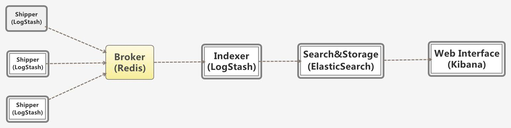

# ELK学习总结
### 1.概览

ELK = ElasticSearch + Logstash + Kibana ,一套经常绑定在一起的日志管理服务框架
日志的分析和监控在系统开发中占非常重要的地位，系统越复杂，日志的分析和监控就越重要，常见的需求有:

* 根据关键字查询日志详情
* 监控系统的运行状况
* 统计分析，比如接口的调用次数、执行时间、成功率等
* 异常数据自动触发消息通知
* 基于日志的数据挖掘

类似的开源Trace系统有

* facebook scribe
* cloudera flume
* twitter zipkin
* storm


>说明：

> * 多个独立的agent(Shipper)负责收集不同来源的数据，一个中心agent(Indexer)负责汇总和分析数据，在中心agent前的Broker(使用redis实现)作为缓冲区，中心agent后的ElasticSearch用于存储和搜索数据，前端的Kibana提供丰富的图表展示。
* Shipper表示日志收集，使用LogStash收集各种来源的日志数据，可以是系统日志、文件、redis、mq等等；
Broker作为远程agent与中心agent之间的缓冲区，使用redis实现，一是可以提高系统的性能，二是可以提高系统的可靠性，当中心agent提取数据失败时，数据保存在redis中，而不至于丢失；
* 中心agent也是LogStash，从Broker中提取数据，可以执行相关的分析和处理(Filter)；
* ElasticSearch用于存储最终的数据，并提供搜索功能；
* Kibana提供一个简单、丰富的web界面，数据来自于ElasticSearch，支持各种查询、统计和展示；

###2.环境搭建
> * 操作系统 ubuntu 14
> * 默认的安装路径均为`/usr/local` 下
> * 如果在操作过程中遇到 `permission xx ` 则在命令前加`sudu`即可


####2.1搭建Redis
* 下载    

```
wget https://github.com/antirez/redis/archive/3.0.0-rc1.tar.gz

```
* 解压 

```
tar zxvf redis-3.0.0-rc1.tar.gz -C /usr/local
```

* 编译

```
cd /usr/local/redis-3.0.0-rc1
mv -f 3.0.0-rc1/ redis/
make
make install
#可使用root用户执行`make install`，将可执行文件拷贝到/usr/local/bin目录下。这样就可以直接敲名字运行程序了。  
```
* 启动和监测


```
#加上&号使redis以后台程序方式运行  
/usr/local/bin/redis-server &  
#检测后台进程是否存在
ps -ef |grep redis
#检测6379端口是否在监听
netstat -lntp | grep 6379
#使用`redis-cli`客户端检测连接是否正常
/usr/local/bin//redis-cli
127.0.0.1:6379> keys *
(empty list or set)
127.0.0.1:6379> set key "hello world"
OK
127.0.0.1:6379> get key
"hello world"
```
* 停止

```
#使用客户端  
redis-cli shutdown
```
####2.2安装Elasticsearch
> 注意如果需要时用Kibana4.x系列的话这块elasticsearch的版本也一定要高于1.4> 

* 下载并解压

```
wget https://download.elastic.co/elasticsearch/elasticsearch/elasticsearch-1.6.0.tar.gz
tar zxvf elasticsearch-1.6.0.tar.gz -C /usr/local
```
* 配置

```
elasticsearch使用默认配置即可，默认的cluster name为：elasticsearch
```
* 启动 添加参数 -d 标示后台运行

```
bin/elasticsearch -d
```

* 停止

```
curl -XPOST 'http://localhost:9200/_shutdown'
```
####2.3安装LogStash
#####2.3.1 中心LogStash
* 下载并解压

```
wget https://download.elasticsearch.org/logstash/logstash/logstash-1.4.2.tar.gz
tar zxvf logstash-1.4.2.tar.gz -C /usr/local/
cd /usr/local/logstash-1.4.2
mkdir conf logs
```
* 配置文件conf/central.conf


```
vim conf/central.conf 
#######################central.conf################### 
input {
	redis {
		host => "127.0.0.1"
		port => 6379 
		type => "redis-input"
		data_type => "list"
		key => "key_count"
	}   
}

output {
	stdout {}
	elasticsearch {
		cluster => "elasticsearch"
		codec => "json"
		protocol => "http"
	}   
}
#######################central.conf################### 
```
* 启动：

```
bin/logstash agent --verbose --config conf/central.conf --log logs/stdout.log
```

#####2.3.2 上报机LogStash
* 步骤和中心LogStash安装步骤类似，之前安装包已下载好直接scp即可
* 配置文件 配置文件conf/shipper.conf

```
input {
	file {
		type => "type_count"
		path => ["/data/logs/count/stdout.log", "/data/logs/count/stderr.log"]
		exclude => ["*.gz", "access.log"]
	}   
}

output {
	stdout {}
	redis {
		host => "$中心stash ip"
		port => 6379
		data_type => "list"
		key => "key_count"
	}   
}
```

####2.4安装Kibana4
>Kibana4 是基于nodeJs的，安装完只需修改config.js配置文件即可启动，或者直接启动

* 下载及解压

```
wget https://download.elastic.co/kibana/kibana/kibana-4.1.0-linux-x64.tar.gz
tar zvxf kibana-4.1.0-linux-x64.tar.gz -C /usr/local/
mv -f kibana-4.1.0-linux-x64/ kibana4/
```
* 启动

```
bin/kibana
```

**环境统统设置完了** 
通过Chrom来访问一下:[Kibana4](http://192.168.2.172:5601/)
###3.ELK高级进阶

###4.自动化部署

###5.资料指南
* [Kibana 中文指南](http://kibana.logstash.es/content/index.html)
* [Elasticsearch 权威指南](http://learnes.net/)


